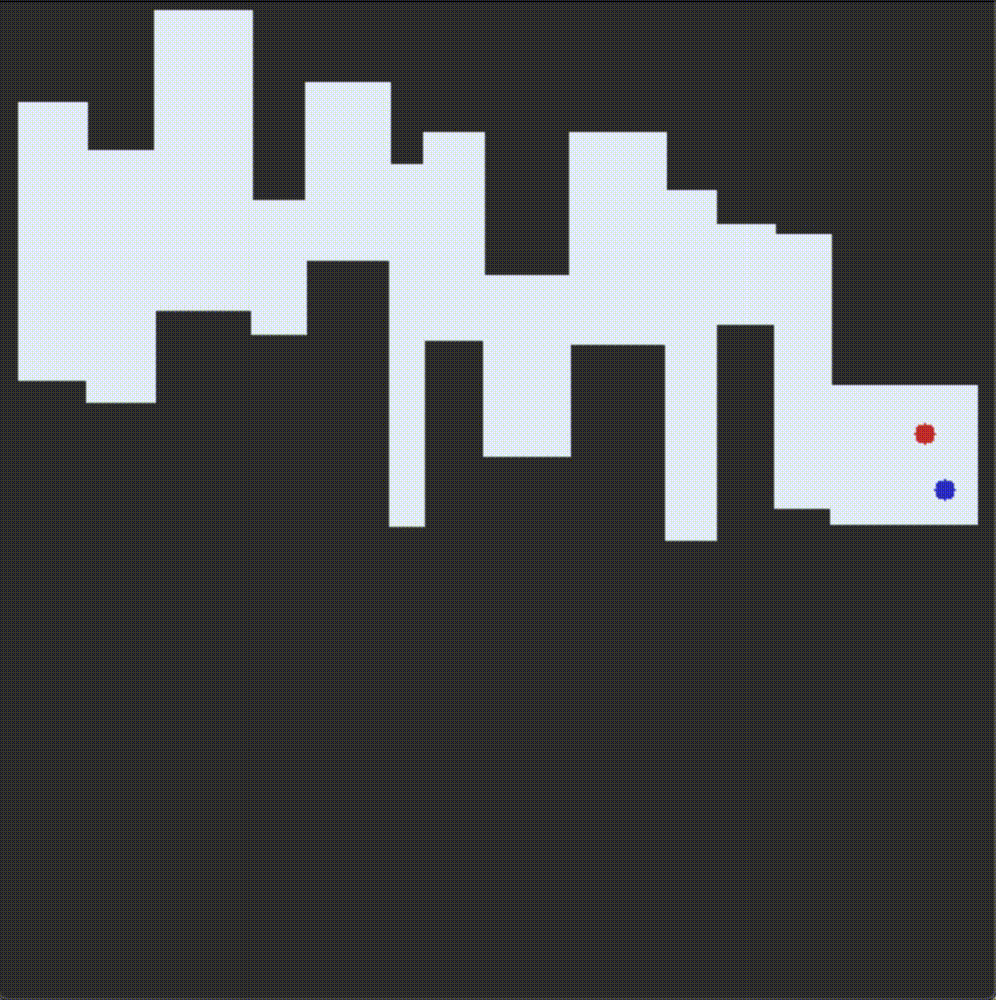

# RL_maze_escape

This is a personal project aiming to train a RL agent using Deep Q-Learning to escape a randomly generated maze. Performance was found to be acceptable but it is not the best, especially when setting the epsilon greedy parameter to zero. There is room for much improvement, see the two anymation below for insights of the agent undergoing exploration in the early traing stages and exploiting the gained knowledge further in the training.


<p>



</p>

<br><br>

## Installation

Clone this repository to your local machine as:

```bash
mkdir your_working_dir
cd your_working_dir
git clone git@gitlab.com:cesare.magnetti/BEng_project.git
```

You will also need to install specific python packages:

```bash
python3 -m venv env
source env/bin/activate
pip install -r requirements.txt
```

## Usage

```bash
# get insights on what paramters you can parse to alter the training process
python main.py -help

# example run
python main.py --display_after 120 --DoubleQLearning --prioritised_experience
```

## Description of implementation process
The following paragraphs will describe the main decisions that were taken through- out the implementation of question 2 and the reasons behind them. Note that as the code is well commented, there will not be any explanation of it in this paragraphs.<br>

Firstly, a Q-Learning implementation with the following hyper-parameters was found to perform well under a number of different environments.

- Q-Network architecture: many experiments were conducted to fine-tune net- work architecture, the best model found consisted of an input layer taking the xy coordinates of the state, 2 hidden layers with 100 features coupled with ReLU and an output layer with 4 nodes, one for each possible action.
- &epsilon; decay rate: &epsilon; must be decayed throughout the episodes in order to achieve an exploitable optimal policy, many decay strategies were tried (exponential, linear, inverse, etc.), in the end it was chosen to settle with a simple 5% decrease in ε at the end of every episode as it gave more consistent results.
- variable episode length: We want the agent to learn how to get to the goal quickly, therefore we should not allow it to take a large number of steps. However, in the early epochs, we want the agent to explore as much of the environment as possible. Hence, a variable episode length was chosen, starting from 1500 steps and decreasing by 2.5% at the and of each episode, without going under 150 steps per episode. Again this hyper-parameter was found through experiments.
- target network updates: after some trial and error, consistency was found up- dating the target network every 1000 steps.
- loss function: after some literature review, it was concluded that state of the art DQN suggest the use of the Huber loss rather than MSE loss due to its higher resistance to outliers. Significant improvement was seen upon this change.
- buffer hyper-parameters: it was observed that a buffer capacity of 5000 steps was the best found compromise between performance and memory usage, going above 5000 steps did not really improve results.

Secondly, a simple modification to the DQN class (which handled the training of the Q-network) sufficed to implement Double Q-Learning, great improvement was ob- served upon this simple change. Finally, a prioritised replay buffer was implemented, and an &alpha; prioritisation factor of 1 was found to give more consistent results. A strong boost in performance was found by developing an early-stop condition, which tested the greedy policy when the agent managed to get to the goal state at low values of &epsilon; and reduced the learning rate until the agent consistently hit the target.

## Contributors
@cesare.magnetti
